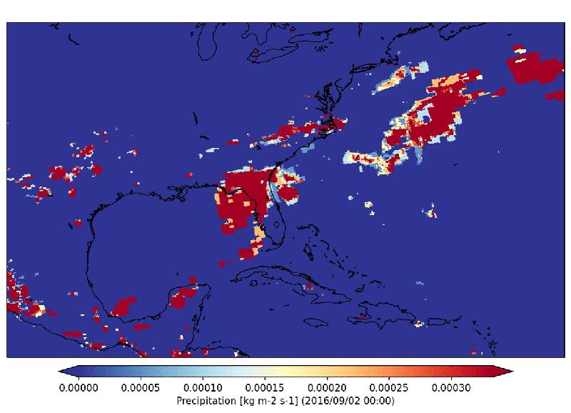

The Freva command line interface
================================

This section introduces the usage of the Freva command line interface -
cli. The tutorial assumes that you have already access to Freva
either because you've setup an instance yourself or one has been setup
by the Freva admin team. Hence it is assumed that you know how to
access Freva. If this is not the case please contact one of your
Freva admins for help.

A general usage overview of the available Freva sub-commands is
available via the ``--help`` option:

.. code:: console

    freva --help

.. execute_code::
   :hide_code:

   from subprocess import run, PIPE
   res = run(["freva", "--help"], check=True, stdout=PIPE, stderr=PIPE)
   print(res.stdout.decode())

The most common sub-commands are ``databrowser`` and ``plugin``. You can
get more help on the actual commands using the sub-commands ``--help``
option, for example getting help on the ``databrowser usage``:

.. code:: console

    freva databrowser --help

.. execute_code::
   :hide_code:

   from subprocess import run, PIPE
   res = run(["freva", "databrowser", "--help"], check=True, stdout=PIPE, stderr=PIPE)
   print(res.stdout.decode())

.. note::
   Instead of using sub-commands you have also the option to use
   commands. For example the command ``freva-databrowser`` is equivalent to
   ``freva databrowser``, ``freva-user-data`` to
   ``freva user-data`` etc.

Searching for data: the ``freva-databrowser`` command
-----------------------------------------------------

All files available on in the project are scanned and indexed via a data
search server. This allows you to query the server which
responds almost immediately. To search for data you can either use the
``freva-databrowser`` command or the ``freva databrowser`` sub-command.
Let’s inspect the help menu of the databrowser sub-command:

.. code:: console

    freva-databrowser --help

.. execute_code::
   :hide_code:

   from subprocess import run, PIPE
   res = run(["freva", "databrowser", "--help"], check=True, stdout=PIPE, stderr=PIPE)
   print(res.stdout.decode())

The databrowser expects a list of key=value pairs. The order of the
pairs doesn’t really matter. Most important is that you don’t need to
split the search according to the type of data you are searching for.
You can search for files within observations, reanalysis and
model data at the same time. Also important is that all queries are
case *insensitive*. You can also search for attributes themselves
instead of file paths. For example you can search for the list of
variables available that satisfies a certain constraint (e.g. sampled
6hr, from a certain model, etc).

.. code:: console

    freva-databrowser project=observations variable=pr model=cp*

.. execute_code::
   :hide_code:

   from subprocess import run, PIPE
   res = run(["freva", "databrowser"], check=True, stdout=PIPE, stderr=PIPE)
   print(res.stdout.decode())

There are many more options for defining a value for a given key:

+-------------------------------------------------+------------------------+
| Attribute syntax                                | Meaning                |
+=================================================+========================+
| ``attribute=value``                             | Search for files       |
|                                                 | containing exactly     |
|                                                 | that attribute         |
+-------------------------------------------------+------------------------+
| ``attribute='val\*'``                           | Search for files       |
|                                                 | containing a value for |
|                                                 | attribute that starts  |
|                                                 | with the prefix val    |
+-------------------------------------------------+------------------------+
| ``attribute='*lue'``                            | Search for files       |
|                                                 | containing a value for |
|                                                 | attribute that ends    |
|                                                 | with the suffix lue    |
+-------------------------------------------------+------------------------+
| ``attribute='*alu\*'``                          | Search for files       |
|                                                 | containing a value for |
|                                                 | attribute that has alu |
|                                                 | somewhere              |
+-------------------------------------------------+------------------------+
| ``attribute='/.*alu.*/'``                       | Search for files       |
|                                                 | containing a value for |
|                                                 | attribute that matches |
|                                                 | the given regular      |
|                                                 | expression (yes! you   |
|                                                 | might use any regular  |
|                                                 | expression to find     |
|                                                 | what you want.)        |
+-------------------------------------------------+------------------------+
| ``attribute=value1 attribute=value2``           | Search for files       |
|                                                 | containing either      |
| OR:                                             | value1 OR value2 for   |
|                                                 | the given attribute    |
| ``attribute={value1,value2}``                   | (note that's the same  |
|                                                 | attribute twice!)      |
+-------------------------------------------------+------------------------+
| ``attribute1=value1 attribute2=value2``         | Search for files       |
|                                                 | containing value1 for  |
|                                                 | attribute1 AND value2  |
|                                                 | for attribute2         |
+-------------------------------------------------+------------------------+
| ``attribute_not_=value``                        | Search for files NOT   |
|                                                 | containing value       |
+-------------------------------------------------+------------------------+
| ``attribute_not_=value1 attribute_not_=value2`` | Search for files       |
|                                                 | containing neither     |
|                                                 | value1 nor value2      |
+-------------------------------------------------+------------------------+

.. note::

    When using \* remember that your shell might give it a
    different meaning (normally it will try to match files with that name)
    to turn that off you can use backslash \ (key=\*) or use quotes (key='*').

In some cases it might be useful to know how many files are found in the
databrowser for certain search constraints. In such cases you can use the
``count`` flag to count the number of *found* files instead of getting
the files themselves.

.. code:: console

    freva-databrowser project=observations --count

.. execute_code::
   :hide_code:

   from subprocess import run, PIPE
   res = run(["freva", "databrowser", "--count"], check=True, stdout=PIPE, stderr=PIPE)
   print(res.stdout.decode())

Sometimes it might be useful to subset the data you're interested in by time.
To do so you can use the `time` search key to subset time steps and whole time
ranges. For example let's get the for certain time range:

.. code:: console

    freva-databrowser project=observations time='2016-09-02T22:15 to 2016-10'

.. execute_code::
   :hide_code:

   from subprocess import run, PIPE
   res = run(["freva", "databrowser", "time=2016-09-02T22:15 to 2016-10"], check=True, stdout=PIPE, stderr=PIPE)
   print(res.stdout.decode())

The default method for selecting time periods is ``flexible``, which means
all files are selected that cover at least start or end date. The
``strict`` method implies that the *entire* search time period has to be
covered by the files. Using the ``strict`` method in the example above would
only yield on file because the first file contains time steps prior to the
start of the time period:

.. code:: console

    freva-databrowser project=observations time='2016-09-02T22:15 to 2016-10' --time-select strict

.. execute_code::
   :hide_code:

   from subprocess import run, PIPE
   res = run(["freva", "databrowser", "time=2016-09-02T22:15 to 2016-10", "--time-select", "strict"], check=True, stdout=PIPE, stderr=PIPE)
   print(res.stdout.decode())

Giving single time steps is also possible:

.. code:: console

    freva-databrowser project=observations time='2016-09-02T22:10'

.. execute_code::
   :hide_code:

   from subprocess import run, PIPE
   res = run(["freva", "databrowser", "time=2016-09-02T22:00"], check=True, stdout=PIPE, stderr=PIPE)
   print(res.stdout.decode())

.. note::

    The time format has to follow the
    `ISO-8601 <https://en.wikipedia.og/wiki/ISO_8601>`_ standard. Time *ranges*
    are indicated by the ``to`` keyword such as ``2000 to 2100`` or
    ``2000-01 to 2100-12`` and alike. Single time steps are given without the
    ``to`` keyword.

You might as well want to know about possible values that an attribute
can take after a certain search is done. For this you use the
``--facet`` flag (facets are the attributes used to search for and sub set
the data). For example to see all facets that are available in the
``observations`` project:

.. code:: console

    freva-databrowser project=observations --facet all

.. execute_code::
   :hide_code:

   from subprocess import run, PIPE
   res = run(["freva", "databrowser", "--facet", "all"], check=True, stdout=PIPE, stderr=PIPE)
   print(res.stdout.decode())

Instead of querying all facets to get information on specific ones:

.. code:: console

    freva-databrowser --facet time_frequency --facet variable project=observations

.. execute_code::
   :hide_code:

   from subprocess import run, PIPE
   res = run(["freva", "databrowser", "--facet", "time_frequency", "--facet", "variable", "project=observations"], check=True, stdout=PIPE, stderr=PIPE)
   print(res.stdout.decode())

You can also retrieve information on how many facets are found by the databrowser
by giving the `count` flag

.. code:: console

    freva-databrowser --facet time_frequency --facet variable project=observations --count

.. execute_code::
   :hide_code:

   from subprocess import run, PIPE
   res = run(["freva", "databrowser", "--facet", "time_frequency", "--facet", "variable", "project=observations", "--count"], check=True, stdout=PIPE, stderr=PIPE)
   print(res.stdout.decode())

In some cases it might be useful to retrieve meta data from a file path this
can be achieved by using the ``file=`` search facet:

.. code:: console

    freva-databrowser file=../.docker/data/observations/grid/CPC/CPC/cmorph/30min/atmos/30min/r1i1p1/v20210618/pr/ --facet all

.. execute_code::
   :hide_code:

   import os, freva
   file = "../.docker/data/observations/grid/CPC/CPC/cmorph/30min/atmos/30min/r1i1p1/v20210618/pr/pr_30min_CPC_cmorph_r1i1p1_201609020000-201609020030.nc"
   res = freva.facet_search(file=str(os.path.abspath(file)))
   for key, value in res.items():
       print(f"{key}: {', '.join(value)}")

Running data analysis plugins: the ``freva-plugin`` command
-----------------------------------------------------------

Already defined data analysis tools can be started with the
``freva-plugin`` command or the ``freva plugin`` sub-command. Let's
inspect the help menu of the ``plugin`` command:

.. code:: console

    freva-plugin --help

.. execute_code::
   :hide_code:

   from subprocess import run, PIPE
   res = run(["freva", "plugin", "--help"], check=True, stdout=PIPE, stderr=PIPE)
   print(res.stdout.decode())

As the help menu suggests you can list all available tools using the
``-l`` option (or ``--list``, ``--list-tools``):

.. code:: console

    freva-plugin -l

.. execute_code::
   :hide_code:

   from subprocess import run, PIPE
   res = run(["freva", "plugin", "-l"], check=True, stdout=PIPE, stderr=PIPE)
   print(res.stdout.decode())

This means currently we have two plugins available (``animator`` and
``dummyplugin``). The general syntax is
``freva-plugin <plugin-name> [options]`` for example to inspect the
documentation of a certain plugin you can use the ``--doc`` option.
Here we concentrate on the Animator plugin. A simple plugin that creates
animations of geospatial data. The basic usage of that command can be
retrieved by:

.. code:: console

    freva-plugin --doc animator

.. execute_code::
   :hide_code:

   from subprocess import run, PIPE
   res = run(["freva", "plugin", "--doc", "animator"], check=True, stdout=PIPE, stderr=PIPE)
   print(res.stdout.decode())

The parameters are also given as key=values pairs. But not all of the
above parameters are mandatory. Let's use one ``project`` search key and
animate its content.

.. code:: console

    freva plugin animator project=observations variable=pr cmap=Blues fps=5 output_unit=mm/h vmin=0 vmax=5 suffix=gif

.. execute_code::
   :hide_code:

   from pathlib import Path
   from subprocess import run, PIPE
   import shutil
   res = run(["freva", "plugin", "animator",
             "project=observations",
             "variable=pr",
             ], check=True, stdout=PIPE, stderr=PIPE)
   out = res.stdout.decode()
   print(out)
   out_f = Path(out.split("\n")[-2].split()[2]).absolute()

The plugin will produce the following output:

This plugin will run in so called interactive mode. That means that it
will run on the login node and block your shell until the command is
completed. This can be problematic if you have jobs that might take time
to finish. An alternative is setting the ``-–batchmode`` flag. This flag
tells the plugin to submit a job to the computing queue. The computing
nodes are the core of any high performance computing system. Let’s
submit the previous plugin job to the computing queue:

.. code:: console

    freva plugin animator project=observations variable=pr cmap=Blues fps=5 output_unit=mm/h vmin=0 vmax=5 suffix=gif --batchmode

.. execute_code::
   :hide_code:

   from pathlib import Path
   from subprocess import run, PIPE
   import shutil
   res = run(["freva", "plugin", "animator",
             "--batchmode",
             "project=observations",
             "variable=pr",
             "cmap=Blues",
             "fps=5",
             "output_unit=mm/h",
             "vmin=0",
             "vmax=5",
             "suffix=gif",
             ], check=True, stdout=PIPE, stderr=PIPE)
   out = res.stdout.decode()
   print(out)

If you want to evaluate the output of the plugin, you can use the ``--json`` flag.
This flag converts the result of a plugin application into a json string that
can be processed by a json parser such as ``jq``. Consider the following
example (in bash/zsh) where we use the ``--json`` flag to get all the netcdf
output files from a plugin run.

.. code:: console

    files=$(freva plugin dummypluginfolders --json|jq -r '.result| keys[] | select(endswith(".nc"))')
    echo $files

.. execute_code::
   :hide_code:

   import freva
   res = freva.run_plugin("dummypluginfolders")
   for file in res.get_result_paths():
      print(file)

.. note::

    If you use the ``--batchmode`` flag in combination with ``--json`` flag the
    command line will wait for the batch job to finish.

Inspecting previous analysis jobs: the ``freva-history`` command
----------------------------------------------------------------

Sometimes it can be useful to access the status of past plugin
applications. The ``freva-history`` command or ``freva history``
sub-command can do that:

.. code:: console

    freva-history --help

.. execute_code::
   :hide_code:

   from subprocess import run, PIPE
   res = run(["freva", "history", "--help"], check=True, stdout=PIPE, stderr=PIPE)
   print(res.stdout.decode())

Let’s get the last entry (default is 10 entries) of the ``dummyplugin`` plugin history

.. code:: console

    freva-history --limit 1 --plugin dummyplugin

.. execute_code::
   :hide_code:

   from subprocess import run, PIPE
   res = run(["freva", "history", "--limit", "1", "--plugin", "dummyplugin"], check=True, stdout=PIPE, stderr=PIPE)
   print(res.stdout.decode())

Dates are given using the `ISO-8601 <https://en.wikipedia.og/wiki/ISO_8601>`_
format.

The entries are sorted by their ``id``. For example you can query the
full configuration by giving the id:

.. code:: console

    freva-history --entry-ids 136 --full-text

.. execute_code::
   :hide_code:

   from subprocess import run, PIPE
   res = run(["freva", "history", "--limit", "1", "--full-text"], check=True, stdout=PIPE, stderr=PIPE)
   print(res.stdout.decode())

To re-run a command of a past configuration you
can use the ``--return-command`` option to get the command that was used:

.. code:: console

    freva-history  --entry-ids 136 --return-command

.. execute_code::
   :hide_code:

   from subprocess import run, PIPE
   res = run(["freva", "history", "--limit", "1", "--return-command"], check=True, stdout=PIPE, stderr=PIPE)
   print(res.stdout.decode())

As with the ``plugin`` subcommand, you can use the ``--json`` flag
to make the output of the history command machine-readable,
and to parse its output. For example, we can query the output files
of the last 3 plugin applications:

.. code:: console

    freva-history  --limit 3 --json|jq -r '.[].result | keys[]'

.. execute_code::
   :hide_code:

   import freva
   for hist in freva.history(limit=3, return_results=True):
      for file in hist["result"].keys():
         print(file)

By default, Freva only shows your user's history. However,
with the ``--all-users`` flag, the query is extended to all users.
For example, while the following Freva command shows the last job run
by you:

.. code:: console

    freva history --limit 1 --json

.. execute_code::
   :hide_code:

   import freva
   import random
   import string
   import datetime
   import socket
   from django.contrib.auth.models import User
   from evaluation_system.model.history.models import History
   from evaluation_system.tests.mocks.dummy import DummyUser
   from subprocess import run, PIPE
   freva.run_plugin("dummypluginfolders")
   N = 10
   random_string = "".join(random.choices(string.ascii_lowercase + string.digits, k=N))
   other_user = User.objects.create_user(
       username=f"user_{random_string}", password="123"
   )
   History.objects.create(
       timestamp=datetime.datetime.now(),
       status=History.processStatus.running,
       uid=other_user,
       configuration='{"some": "config", "dict": "values"}',
       tool=f"dummytool_{random_string}",
       slurm_output="/path/to/slurm-44742.out",
       host=socket.gethostbyname(socket.gethostname()),
   )
   other_user.delete()
   res_my_user = run(["freva", "history", "--limit", "1", "--json"], check=True, stdout=PIPE, stderr=PIPE)
   print(res_my_user.stdout.decode())

The following one will also take in account other users:

.. code:: console

    freva history --limit 1 --json --all-users

.. execute_code::
   :hide_code:

   from subprocess import run, PIPE
   res_all_users = run(["freva", "history", "--limit", "1", "--json", "--all-users"], check=True, stdout=PIPE, stderr=PIPE)
   print(res_all_users.stdout.decode())

Managing your own datasets: the ``freva-user-data`` command
-----------------------------------------------------------

Freva offers the possibility to share custom datasets with other users
by making it searchable via ``freva-databrowser``. With help of the
``freva-user-data`` command users can add their own data to the
central data location, (re)-index or delete data in the databrowser.

.. note::

    Any data that has been added by users will be assigned a special project
    name: ``project=user-$USER``.

Let's inspect the help menu of the ``freva-user-data`` or ``freva user-data``
command:

.. code:: console

    freva-user-data --help

.. execute_code::
   :hide_code:

   from subprocess import run, PIPE
   res = run(["freva", "user-data", "--help"], check=True, stdout=PIPE, stderr=PIPE)
   print(res.stdout.decode())

Add new data to the databrowser
~~~~~~~~~~~~~~~~~~~~~~~~~~~~~~~

To be able to add data to the databrowser the file names must follow a strict
standard and the files must reside in a specific location. The
``add`` sub command takes care about the correct file naming and location.
No pre requirements other than the file has to be a valid ``netCDF`` or
``grib`` file are assumed. In other words this sub command places the user data
with the correct naming structure to the correct location.

.. code:: console

    freva-user-data add --help

.. execute_code::
   :hide_code:

   from subprocess import run, PIPE
   res = run(["freva", "user-data", "add", "--help"], check=True, stdout=PIPE, stderr=PIPE)
   print(res.stdout.decode())

Suppose you've gotten data from somewhere and want to add this data into the
databrowser to make it accessible to others. In this specific
example we assume that you have stored your `original` data in the
``/tmp/my_awesome_data`` folder.
E.g ``/tmp/my_awesome_data/outfile_0.nc...tmp/my_awesome_data/outfile_9.nc``
The routine will try to gather all necessary metadata from the files. You'll
have to provide additional metadata if mandatory keywords are missing.
To make the routine work in this example we have to provide the ``institute``,
``model`` and ``experiment`` keywords:

.. code:: console

    freva-user-data add eur-11b /tmp/my_awesome_data/outfile_?.nc \
    --institute clex --model UM-RA2T --experiment Bias-correct
    freva-databrowser experiment=bias-correct

.. execute_code::
   :hide_code:

   from subprocess import run, PIPE
   res = run(["freva", "user-data", "add", "eur-11b", "/tmp/my_awesome_data/outfile_?.nc",
              "--institute", "clex", "--model", "UM-RA2T", "--experiment",
              "Bias-correct"], check=True, stdout=PIPE, stderr=PIPE)
   print(res.stdout.decode())
   run(["freva-databrowser", "experiment=bias-correct"], check=True, stderr=PIPE)

.. note::
   Freva allows also *plugins* to directly index output datasets via
   :class:`add_output_to_databrowser` method (``linkmydata`` is the deprecated
   method of former Freva versions). For more information please
   take a look at :ref:`PluginAPI`.

Remove your data from the databrowser
~~~~~~~~~~~~~~~~~~~~~~~~~~~~~~~~~~~~~

The ``delete`` sub command removes entries from the databrowser and if necessary
existing files from the central user data location.

.. code:: console

    freva-user-data delete --help

.. execute_code::
   :hide_code:

   from subprocess import run, PIPE
   res = run(["freva", "user-data", "delete", "--help"], check=True, stdout=PIPE, stderr=PIPE)
   print(res.stdout.decode())

Any data in the central user directory that belongs to the user can
be deleted from the databrowser and also from the central data location:

.. code:: console

    freva-user-data delete /tmp/user_data/user-<user_name>
    freva-databrowser experiment=bias-correct

.. execute_code::
   :hide_code:

   from freva import UserData
   from subprocess import run, PIPE
   user_data = UserData()
   user_data.delete(user_data.user_dir)
   run(["freva-databrowser", "experiment=bias-correct"], check=True, stderr=PIPE)

(Re)-Index existing data to the databrowser
~~~~~~~~~~~~~~~~~~~~~~~~~~~~~~~~~~~~~~~~~~~

The ``index`` subcommand can be used to update the databrowser for existing
user data. For example, if data has been removed from the databrowser it can
be re-added:

.. code:: console

    freva-user-data index --help

.. execute_code::
   :hide_code:

   from subprocess import run, PIPE
   res = run(["freva", "user-data", "index", "--help"], check=True, stdout=PIPE, stderr=PIPE)
   print(res.stdout.decode())

Currently, only files on the file system (``--data-type {fs}``) are supported.

.. code:: console

    freva-user-data delete /tmp/user_data/user-freva
    freva-databrowser experiment=bias-correct

.. execute_code::
   :hide_code:

   from freva import UserData
   from subprocess import run, PIPE
   user_data = UserData()
   user_data.index(user_data.user_dir)
   run(["freva-databrowser", "experiment=bias-correct"], check=True, stderr=PIPE)

Searching for ESGF data: the ``freva-esgf`` command
--------------------------------------------------------

The ``freva-esgf`` command or the ``freva esgf`` sub-command provides
a search syntax to look the model data through all the ESGF portals and
it is derived from
`ESGF's rest API <https://github.com/ESGF/esgf.github.io/wiki/ESGF_Search_REST_API>`__,
although it has been simplified to be used from the command line and
resembles ``freva-databrowser`` as close as possible.
Despite the similarities, the two commands rely on different backends
which have different query possibilities.

.. note::

    The `Earth System Grid Federation <http://esgf.llnl.gov/>`_ (ESGF)
    maintains a global system of federated data centers that allow access to
    the largest archive of model climate data world-wide. ESGF portals
    are an interface for users to access model data that are distributed in several
    data centers, also called data nodes, although they themselves do not
    host any data (e.g. `DKRZ <https://esgf-data.dkrz.de/projects/esgf-dkrz/>`_).
    Through them we can access to the output of the climate
    models contributing to the next assessment report of the
    Intergovernmental Panel on Climate Change `IPCC <http://www.ipcc.ch/>`__
    through the Coupled Model Intercomparison Project
    `CMIP <https://wcrp-cmip.org/>`_.

Let's inspect the help menu of the ``esgf`` sub-command:

.. code:: console

    freva-esgf --help

.. execute_code::
   :hide_code:

   from subprocess import run, PIPE
   res = run(["freva", "esgf", "--help"], check=True, stdout=PIPE, stderr=PIPE)
   print(res.stdout.decode())

Similarly to ``freva-databrowser``, ``freva-esgf`` expects a list of ``key=value`` pairs
in no particular order, but unlike the former it *is* case sensitive.

For example, given that your Freva instance is configured at DKRZ,
if we want to search the URLs of all the files stored
at the (DKRZ) local node (``distrib=false``) holding the latest version
(``latest=true``) of the variable tas (``variable=tas``) for the
experiment ``decadal1960`` and project ``CMIP5``, then:

.. code:: console

    freva-esgf project=CMIP5 experiment=decadal1960 variable=tas distrib=false latest=true

.. execute_code::
    :hide_code:

    import freva
    files = freva.esgf_browser(project="CMIP5", experiment="decadal1960", variable="tas", distrib=False, latest=True)
    print("\n".join(files[:5]))
    print("...")

However, be aware that the syntax of the query may change depending
on the targeted dataset, for instance for ``CMIP6``:

.. code:: console

    freva esgf project=cmip6 product=scenariomip model=cnrm-cm6-1 institute=cnrm-cerfacs experiment=ssp585 time_frequency=3hr variable=uas ensemble=r1i1p1f2 distrib=false latest=true

.. execute_code::
    :hide_code:

    import freva
    files = freva.esgf_browser(
        project="cmip6",
        product="scenariomip",
        experiment="ssp585",
        model="cnrm-cm6-1",
        institute="cnrm-cerfacs",
        ensemble="r1i1p1f2",
        variable="uas",
        distrib=False,
        latest=True
    )

will not produce any result, while

.. code:: console

    freva esgf mip_era=CMIP6 activity_id=ScenarioMIP source_id=CNRM-CM6-1 institution_id=CNRM-CERFACS experiment_id=ssp585 frequency=3hr variable=uas variant_label=r1i1p1f2 distrib=false latest=true

.. execute_code::
    :hide_code:

    import freva

    files = freva.esgf_browser(
        mip_era="CMIP6",
        activity_id="ScenarioMIP",
        source_id="CNRM-CM6-1",
        institution_id="CNRM-CERFACS",
        experiment_id="ssp585",
        frequency="3hr",
        variable="uas",
        variant_label="r1i1p1f2",
        distrib=False,
        latest=True
    )
    print("\n".join(files[:5]))
    print("...")

will yield the desired output. Note that not only the facets are different from
``freva-databrowser`` but also each value is case sensitive. The naming of the
facets can be, for example, consulted at the corresponding ESGF portal
(e.g. for `CMIP6 at DKRZ <https://esgf-data.dkrz.de/search/cmip6-dkrz/>`_).

To show the values of certain attributes you can use the ``--show-facet FACET`` flag.
For example, for ``time_frequency`` :

.. code:: console

    freva esgf project=CMIP5 experiment=decadal1960 variable=tas distrib=false latest=true --show-facet=time_frequency

.. execute_code::
    :hide_code:

    from subprocess import run, PIPE
    res = run(["freva", "esgf", "project=CMIP5",
                        "experiment=decadal1960",
                        "variable=tas", "distrib=false", "latest=true",
                        "--show-facet=time_frequency"],
                check=True, stdout=PIPE, stderr=PIPE)
    print(res.stdout.decode())

Similarly to ``--show-facet``, ``--query QUERY`` displays ``key=value`` metadata pairs (not limited
to attributes only) of selected elements for a search but grouped per dataset.
For example we could query selected metadata information (e.g. ``mip_era,variable,variant_label,url``)
of a certain CMIP6 search and display it grouped by dataset:

.. code:: console

    freva esgf mip_era=CMIP6 activity_id=ScenarioMIP source_id=CNRM-CM6-1 institution_id=CNRM-CERFACS experiment_id=ssp585 frequency=3hr variable=uas,pr distrib=false latest=true --query=mip_era,variable,variant_label,url

.. execute_code::
   :hide_code:

   from subprocess import run, PIPE
   res = run(["freva", "esgf", "mip_era=CMIP6", "activity_id=ScenarioMIP", "source_id=CNRM-CM6-1",
             "institution_id=CNRM-CERFACS", "experiment_id=ssp585", "frequency=3hr", "variable=uas,pr",
             "distrib=false", "latest=true", "--query=mip_era,variable,variant_label,url"], check=True, stdout=PIPE, stderr=PIPE)
   print(res.stdout.decode())

To show the name of the datasets instead of the URLs use the ``--datasets`` flag:

.. code:: console

    freva esgf mip_era=CMIP6 activity_id=ScenarioMIP source_id=CNRM-CM6-1 institution_id=CNRM-CERFACS experiment_id=ssp585 frequency=3hr variable=uas variant_label=r1i1p1f2 distrib=false latest=true --datasets

.. execute_code::
    :hide_code:

    from subprocess import run, PIPE
    res = run(["freva", "esgf", "mip_era=CMIP6", "activity_id=ScenarioMIP",
                "source_id=CNRM-CM6-1", "institution_id=CNRM-CERFACS",
                "experiment_id=ssp585", "frequency=3hr", "variable=uas",
                "variant_label=r1i1p1f2", "distrib=false", "latest=true",
                "--datasets"], check=True, stdout=PIPE, stderr=PIPE)
    print(res.stdout.decode())

One can retrieve the opendap endpoints instead of the urls as well with ``--opendap``, for example:

.. code:: console

    freva esgf mip_era=CMIP6 activity_id=ScenarioMIP source_id=CNRM-CM6-1 institution_id=CNRM-CERFACS experiment_id=ssp585 frequency=3hr variable=uas variant_label=r1i1p1f2 distrib=false latest=true --opendap

.. execute_code::
    :hide_code:

    import freva
    files = freva.esgf_browser(
        mip_era="CMIP6",
        activity_id="ScenarioMIP",
        source_id="CNRM-CM6-1",
        institution_id="CNRM-CERFACS",
        experiment_id="ssp585",
        frequency="3hr",
        variable="uas",
        variant_label="r1i1p1f2",
        distrib=False,
        latest=True,
        opendap=True,
    )
    print("\n".join(files))

Or the gridftp endpoints instead (``--gridftp``):

.. code:: console

    freva esgf mip_era=CMIP6 activity_id=ScenarioMIP source_id=CNRM-CM6-1 institution_id=CNRM-CERFACS experiment_id=ssp585 frequency=3hr variable=uas variant_label=r1i1p1f2 distrib=false latest=true --gridftp

.. execute_code::
    :hide_code:

    import freva
    files = freva.esgf_browser(
        mip_era="CMIP6",
        activity_id="ScenarioMIP",
        source_id="CNRM-CM6-1",
        institution_id="CNRM-CERFACS",
        experiment_id="ssp585",
        frequency="3hr",
        variable="uas",
        variant_label="r1i1p1f2",
        distrib=False,
        latest=True,
        gridftp=True,
    )
    print("\n".join(files))

Since the queries yield a list of URLs to the netCDF files
there are not readily available to use. Freva can create a bash script written
around wget to simplify data download with the ``--download-script /foo/bar.wget``
option, where ``/foo/bar.wget`` is the destination wget file:

.. code:: console

    freva esgf --download-script /tmp/script.wget project=CMIP5 experiment=decadal1960 variable=tas distrib=false latest=true

.. execute_code::
   :hide_code:

   from subprocess import run, PIPE
   res = run(["freva", "esgf", "--download-script", "/tmp/script.wget", "project=CMIP5", "experiment=decadal1960",
              "variable=tas", "distrib=false", "latest=true"], check=True, stdout=PIPE, stderr=PIPE)
   print(res.stdout.decode())

.. note::

    In order to download the data you will need an ESGF account
    (e.g. via `DKRZ's portal <https://esgf-data.dkrz.de/user/add/?next=http://esgf-data.dkrz.de/projects/esgf-dkrz/>`_),
    where after entering a ``<username>`` and ``password``
    you will get an openID (``https://esgf-data.dkrz.de/esgf-idp/openid/<username>``)
    to use while running the script with the ``-H`` flag, e.g.:

    .. code:: console

        > /tmp/script.wget.sh -H

        Running script.wget version: 1.3.2
        Use script.wget -h for help.

        Warning! The total number of files was 2338 but this script will only process 1000.
        There were files with the same name which were requested to be download to the same directory. To avoid overwriting the previous downloaded one they were skipped.
        Please use the parameter 'download_structure' to set up unique directories for them.
        Script created for 916 file(s)
        (The count won't match if you manually edit this file!)

        Enter your openid :  https://esgf-data.dkrz.de/esgf-idp/openid/<username>
        Enter password : <password>

    Alternatively you can also retrieve the data using certificates,
    for example through the `ESGF PyClient <https://esgf-pyclient.readthedocs.io/en/latest/index.html>`_.
    You will still need your openID for that.
